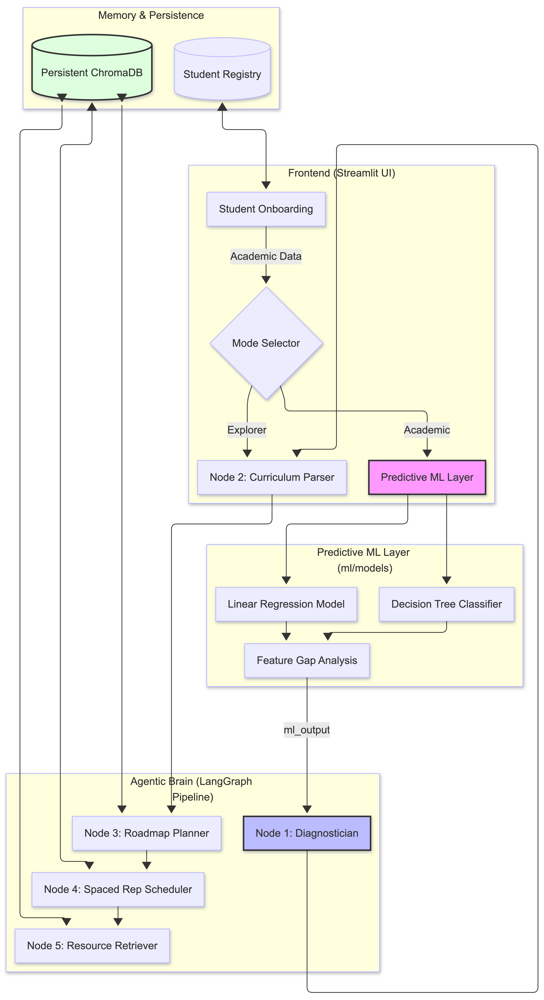
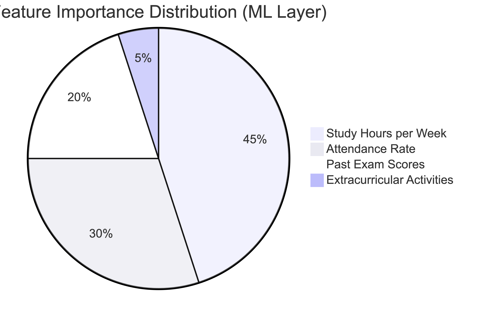
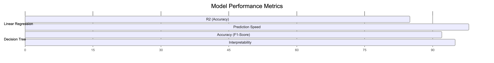

# GradeMinds AI: An Agentic Learning Ecosystem

GradeMinds AI is a sophisticated, production-grade learning platform that leverages the intersection of **Agentic AI Orchestration**, **Predictive Machine Learning**, and **Persistent Vector Memory**. It transforms fragmented educational data into structured, personalized, and long-term learning journeys.

---

## Strategic Value Proposition

GradeMinds AI is engineered to eliminate the cognitive overhead of curriculum management and academic performance tracking through three core intelligence layers:

### 1. Predictive Performance Modeling (The ML Layer)
By analyzing student attributes (study habits, attendance, past scores) against historical datasets, GradeMinds AI predicts individual exam performance and identifies critical "Knowledge Gaps" before the student even begins their study journey.

### 2. Semantic Curriculum Orchestration (The Agentic Layer)
Utilizing a multi-node LangGraph framework, the system distills raw syllabi into atomic learning milestones, sequenced logically via topological dependencies and Bloom's Taxonomy.

### 3. Systematic Knowledge Mastery (The Memory Layer)
The platform mitigates knowledge decay via an SM-2-inspired Spaced Repetition engine, ensuring that reviews are scheduled exactly when retention begins to fade, turning short-term learning into long-term cognitive mastery.

---

##  System Architecture & Workflow

GradeMinds AI operates on a high-fidelity pipeline consisting of five specialized agentic nodes, integrated with a dedicated Predictive ML module.



### 1. The Predictive ML Layer (`ml/`)
The foundation of "Academic Mode," this layer utilizes dual-model inference to assess student readiness:
- **Linear Regression Model**: Predicts a granular exam score (0–100).
- **Decision Tree Classifier**: Determines Pass/Fail probability and generates a relative feature importance map.
- **Gap Analysis**: Computes the "Score Impact" of each student attribute, allowing the system to prioritize interventions (e.g., "Increase study hours by 4 hrs/week to gain ~12 points").

#### Model Performance & Feature Importance
The system compares multiple modeling approaches to ensure high-fidelity predictions. The current production environment utilizes a Decision Tree Classifier for pass/fail probability due to its superior non-linear pattern recognition.

<p align="center">
  
</p>

<p align="center">
  
</p>

### 2. The Agentic Brain (`agent/nodes/`)
The orchestrator sequences the learning experience across five distinct phases:

1.  **Node 1: The Diagnostician**: Synthesizes ML outputs into plain-English "Academic Diagnoses," providing actionable recommendations and risk assessments.
2.  **Node 2: Curriculum Parser**: Processes PDFs/text to extract topics, assigning Bloom's Taxonomy levels to differentiate between "Foundational" and "Expert" concepts.
3.  **Node 3: Roadmap Planner**: Sequences extracted topics into a topological graph, ensuring prerequisite mastery before advanced concept introduction.
4.  **Node 4: Spaced Repetition Scheduler**: A pure-logic engine that calculates the "Daily Briefing," identifying which topics move to the "Review Queue" and which "New Topic" should be introduced today.
5.  **Node 5: Resource Retriever**: Curates high-quality external study materials (YouTube, Wikipedia, academic journals) using Tavily Web Search and ChromaDB-backed deduplication.

---

##  Memory & Data Integrity (`memory/`)

The platform ensures 100% data isolation and session persistence through a custom memory architecture:
- **Student Registry**: Secure hashing for credentials and multi-user data isolation.
- **Persistence Bridge**: Synchronizes local Streamlit state with browser `localStorage` and URL parameters to ensure sessions survive across browser refreshes.
- **Persistent ChromaDB**: All roadmaps, topics, and curated resources are stored in specialized vector collections, allowing the AI to "remember" every student's unique progress across sessions.

---

##  Technical Foundation

- **Orchestration**: LangGraph (v0.2.x) with custom Pydantic-validated state management.
- **Predictive ML**: Scikit-learn (Decision Trees, Linear Regression) via `joblib`.
- **LLM**: Llama-3.1-8b-instant (via Groq) for high-speed semantic extraction.
- **Vector Database**: ChromaDB (v0.5.x) for persistent knowledge retrieval.
- **Inference**: Tavily API for trusted, filtered educational web search.
- **Frontend**: Streamlit with custom CSS (Glassmorphism, soft mint/sky-blue palette).

---

##  Project Structure

```text
grademinds-ai-2.0/
├── agent/                  # LangGraph Pipeline
│   ├── nodes/              # Specialized Agentic Processors
│   └── graph.py            # Orchestration Logic
├── memory/                 # Data Persistence Layer
│   ├── student_registry.py # User & Course DB
│   └── chroma_ops.py       # Vector Memory Ops (Roadmaps, Topics)
├── ml/                     # Predictive Analytics Layer
│   ├── models/             # Pickle Files (Classifier, Regressor)
│   └── predictor.py        # ML Inference & Gap Analysis
├── ui/                     # Streamlit Interface Layer
│   └── screens/            # Application Screen Components
├── app.py                  # Main Entry Point & Session Dispatcher
└── grademinds_db/          # Persistent ChromaDB Storage (Local)
```

---

*GradeMinds AI — Transforming raw information into structured intelligence.*
